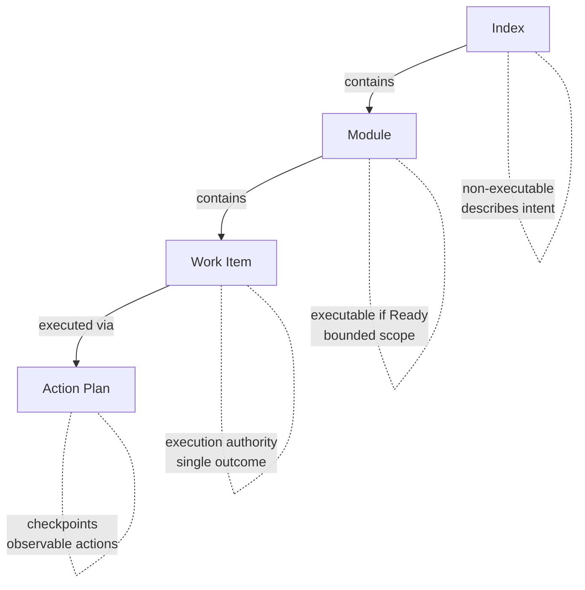

# Anvil Plan Spec (APS)

A lightweight specification format for planning and work item authorisation in
AI-assisted development.

## What is APS?

APS provides a structured way to:

- **Plan work** before implementation begins
- **Authorise work items** that AI agents can execute
- **Track execution** through observable checkpoints

It acts as a trust layer between humans and AI — humans remain accountable
for decisions while AI assists with planning and implementation.

## Why APS?

There's no shortage of AI coding tools — Cursor, Kiro, Claude Code, Copilot,
and countless agent frameworks. Each has its own way of handling context,
rules, and specifications. **The problem: your planning artefacts get locked
into whatever tool you're using today.**

APS is different:

- **Portable** — Plain markdown files. No vendor lock-in. Switch tools anytime.
- **Versioned** — Lives in git. Review plans in PRs. Track changes over time.
- **Tool-agnostic** — Works with any AI, any IDE, any workflow.
- **Human-readable** — Your PM, tech lead, and future self can all understand it.

APS isn't a replacement for your AI tools — it's the planning layer that works
*across* all of them. Write your spec once, use it everywhere.

> **Want to see APS in action?** Jump to [examples](examples/) or see the
> [Hello World](#hello-world-example) below.

## Philosophy: Compound Engineering

APS embraces the principle of **compound engineering**: each unit of engineering
work should make subsequent units easier—not harder.

Traditional development accumulates technical debt. Every feature adds complexity.
The codebase becomes harder to work with over time. Compound engineering inverts
this by investing heavily in planning and review upfront, so execution is fast
and clean.

**The 80/20 split:**

- **80% planning and review** — Thorough specs, clear work items, validated
  checkpoints
- **20% execution** — Fast implementation following well-defined plans

**The planning lifecycle:**

```
Plan → Execute → Validate → Learn → Plan again
  ↑                                      │
  └──────────────────────────────────────┘
```

| Phase | What Happens | How It Serves Planning |
|-------|--------------|------------------------|
| **Plan** | Define scope, success criteria, work items | Reference past patterns and solutions |
| **Execute** | Work against well-defined specs | Clean implementation, fewer blockers |
| **Validate** | Check outcomes against spec | Verify plan was correct, update if not |
| **Learn** | Document solutions and learnings | Future plans start with known answers |

Planning without validation is guesswork. Validation without learning repeats
mistakes. The cycle exists to make each plan better than the last.

See [docs/workflow.md](docs/workflow.md) for the full workflow guide.

## Hierarchy



| Layer | Purpose | Executable? |
|-------|---------|-------------|
| **Index** | High-level plan with modules and milestones | No |
| **Module** | Bounded scope with interfaces and work items | If status is Ready |
| **Work Item** | Single coherent change with validation | Yes — execution authority |
| **Action Plan** | Ordered actions with checkpoints | Yes — granular execution |

**Key concepts:**

- **Index** — The root plan. Describes the whole initiative, lists modules.
- **Module** — A bounded area where work happens. The smallest unit you *plan*.
  You don't subdivide modules into sub-plans — they contain work items directly.
- **Work Item** — A single authorised change. The unit of execution authority.
- **Action Plan** — How you *execute* a work item. Optional, generated when needed. Breaks
  a work item into checkpointed actions for granular progress tracking.

## Quick Start

### Option A: curl (recommended)

```bash
# Install in current directory
curl -fsSL https://raw.githubusercontent.com/EddaCraft/anvil-plan-spec/main/scaffold/install | bash

# Install in a specific directory
curl -fsSL https://raw.githubusercontent.com/EddaCraft/anvil-plan-spec/main/scaffold/install | bash -s -- /path/to/project

# Install a specific version (use a git tag or branch name, e.g., v0.2.0 or main)
curl -fsSL https://raw.githubusercontent.com/EddaCraft/anvil-plan-spec/main/scaffold/install | VERSION=v0.2.0 bash

# Update existing project (preserves your specs)
curl -fsSL https://raw.githubusercontent.com/EddaCraft/anvil-plan-spec/main/scaffold/update | bash
```

This creates `plans/` with templates and `aps-rules.md` — a portable guide that
helps AI agents follow APS conventions.

### Option B: Manual Setup

1. Copy templates from `templates/` to your project
2. Create an Index to define your plan's scope and modules
3. Create modules for each bounded area of work
4. Add Work Items when a module is ready for implementation
5. Generate Action Plans (optional) for granular execution guidance

See [Getting Started](docs/getting-started.md) for a complete walkthrough.

## Platform Support

| Platform | CLI | Hooks | Install Script |
|----------|-----|-------|----------------|
| **Linux** | Bash 4.0+ | Bash 4.0+ | `curl \| bash` |
| **macOS** | Bash 4.0+ (Homebrew) | Bash 4.0+ (Homebrew) | `curl \| bash` |
| **Windows** | PowerShell 5.1+ | Coming soon | Manual setup |

### Prerequisites

- **Linux/macOS:** Bash 4.0+, curl, git
- **Windows:** PowerShell 5.1+ (ships with Windows 10+) or PowerShell 7+
- **All platforms:** git (optional, needed for hooks)

### macOS

macOS ships with Bash 3.2 (2007). APS requires Bash 4.0+ for associative
arrays. Install a modern version via Homebrew:

```bash
# Check your version
bash --version

# Install Bash 4+ via Homebrew
brew install bash

# The APS CLI uses #!/usr/bin/env bash, so Homebrew's bash is picked up
# automatically if /usr/local/bin (Intel) or /opt/homebrew/bin (Apple Silicon)
# is in your PATH (Homebrew sets this up by default).
```

### Windows

APS includes a native PowerShell port of the CLI. No WSL or Git Bash needed
for linting:

```powershell
# Lint all plans
.\bin\aps.ps1 lint plans\

# Lint a specific file
.\bin\aps.ps1 lint plans\modules\auth.aps.md

# JSON output
.\bin\aps.ps1 lint plans\ --json

# Help
.\bin\aps.ps1 --help
```

Alternatively, use WSL or Git Bash to run the standard Bash CLI.

> **Note:** Hook scripts (SessionStart, PreToolUse, Stop, etc.) are currently
> Bash-only. A PowerShell port is planned. Windows users can use hooks via WSL
> or Git Bash in the meantime.

## Validation

Validate your APS documents with the built-in CLI:

```bash
# Lint all plans
./bin/aps lint plans/

# Lint a specific file
./bin/aps lint plans/modules/auth.aps.md

# JSON output for CI
./bin/aps lint plans/ --json
```

The linter checks for:

- Missing required sections (Purpose, Work Items, Modules)
- Missing work item fields (Intent, Expected Outcome, Validation)
- Malformed task IDs (should be `PREFIX-NNN`, e.g., `AUTH-001`)
- Empty sections and other common issues

See [docs/ci-lint-example.yml](docs/ci-lint-example.yml) for GitHub Actions integration.

## Works Everywhere

APS is just markdown. Use it however you work:

| Context | How to use APS |
|---------|----------------|
| **Claude / ChatGPT** | Paste the spec into your conversation |
| **Cursor / Copilot** | Keep specs in your repo, reference in prompts |
| **Claude Code / aider** | Point the agent at your spec files |
| **Jira / Linear / Notion** | Link to specs in git, or embed the markdown |
| **Code review** | Review spec changes in PRs before implementation |
| **Team planning** | Specs are human-readable — discuss them in meetings |

No plugins. No integrations. No configuration. It's just files.

## Templates

| Template | Use When |
|----------|----------|
| [quickstart.template.md](templates/quickstart.template.md) | **Try APS in 5 minutes** — minimal single-file format |
| [index.template.md](templates/index.template.md) | Starting a new plan or initiative |
| [index-expanded.template.md](templates/index-expanded.template.md) | Larger initiatives with 6+ modules or rich metadata |
| [module.template.md](templates/module.template.md) | Defining a bounded module with work items |
| [simple.template.md](templates/simple.template.md) | Small, self-contained features |
| [actions.template.md](templates/actions.template.md) | Breaking work items into executable actions |
| [solution.template.md](templates/solution.template.md) | Documenting solved problems (compound phase) |

### Hello World Example

```markdown
# Add Dark Mode

## Problem
Users want to reduce eye strain when working at night.

## Success
- [ ] Toggle persists across sessions
- [ ] All components respect theme

## Work Items

### 001: Add theme context
- **Outcome:** ThemeProvider wraps app, exposes toggle
- **Test:** `npm test -- theme.test.tsx`

### 002: Add toggle to settings
- **Outcome:** Settings page has working theme toggle
- **Test:** Manual verification
- **Depends on:** 001
```

## Examples

- [User Authentication](examples/user-auth/) — Adding auth to an existing app
- [OpenCode Companion App](examples/opencode-companion/) — Building a companion tool

## AI Guidance

APS includes `aps-rules.md` — a portable guide that travels with your specs.
Point your AI agent at this file and it will follow APS conventions.

- [AI Agent Implementation Guide](docs/ai-agent-guide.md) — Full guide for LLMs
- [Prompts](docs/ai/prompting/) — Tool-agnostic prompts
- [AGENTS.md](AGENTS.md) — Collaboration rules for this repo

## Principles

1. **Specs describe intent** — what and why, not how
2. **Work items authorise execution** — no work item, no implementation
3. **Humans remain accountable** — AI proposes, humans approve
4. **Checkpoints are observable** — every action has a verifiable state

## Project Structure

```text
your-project/
├── plans/
│   ├── aps-rules.md              # AI agent guidance (portable)
│   ├── index.aps.md              # Main plan
│   ├── modules/                  # Leaf modules
│   │   ├── auth.aps.md
│   │   └── payments.aps.md
│   ├── execution/                # Action plan files
│   │   └── AUTH-001.actions.md
│   └── decisions/                # ADRs (optional)
│       └── 001-use-jwt.md
```

## Versioning

This project does not currently publish versioned releases. The `main` branch
is considered stable. See [CHANGELOG.md](CHANGELOG.md) for recent changes.

## Roadmap

See [ROADMAP.md](ROADMAP.md) for planned features and direction.

## Contributing

See [CONTRIBUTING.md](CONTRIBUTING.md).

## License

Apache-2.0. See [LICENSE](LICENSE).
