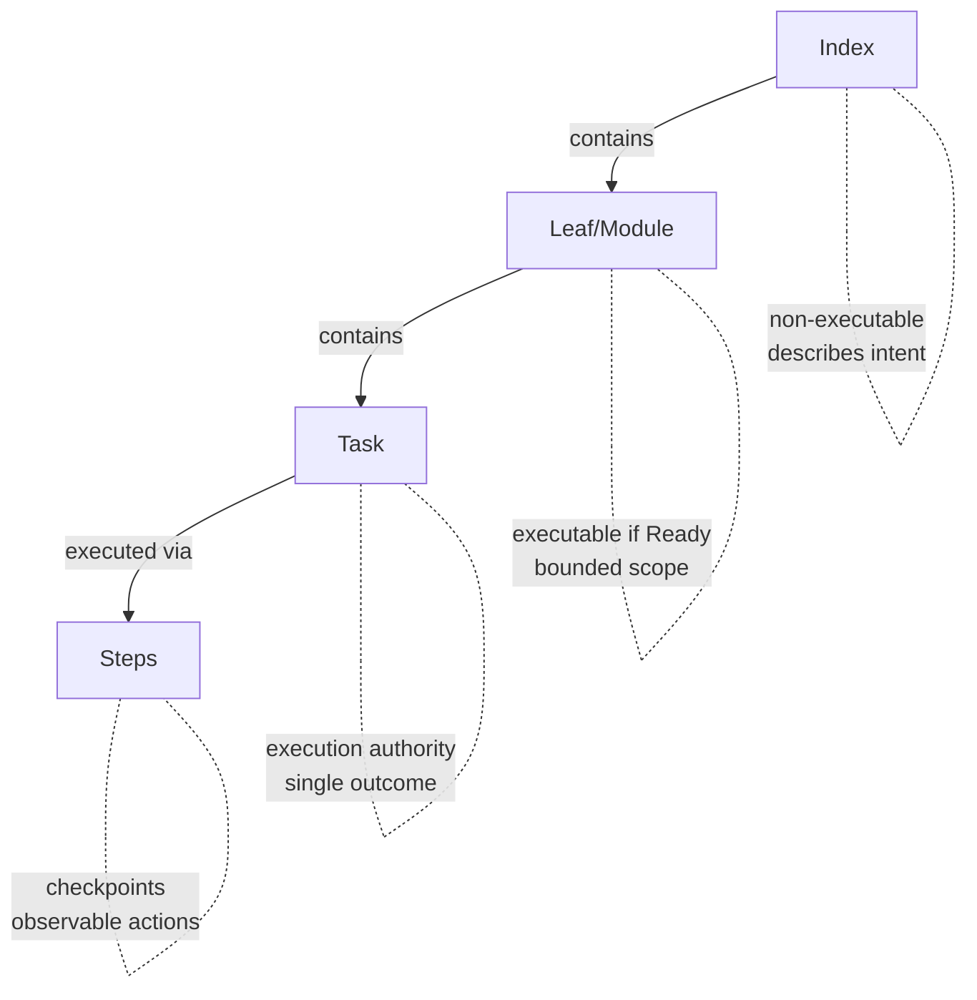

# Anvil Plan Spec (APS)

A lightweight specification format for planning and task authorization in AI-assisted development.

## What is APS?

APS provides a structured way to:

- **Plan work** before implementation begins
- **Authorize tasks** that AI agents can execute
- **Track execution** through observable checkpoints

It acts as a trust layer between humans and AI — humans remain accountable for decisions while AI assists with planning and implementation.

## Hierarchy

| Layer | Purpose | Executable? |
|-------|---------|-------------|
| **Index** | High-level plan with modules and milestones | No |
| **Leaf/Module** | Bounded scope with interfaces and tasks | If status is Ready |
| **Task** | Single coherent change with validation | Yes — execution authority |
| **Steps** | Ordered actions with checkpoints | Yes — granular execution |

## Quick Start

1. **Copy templates** from `templates/` to your project
2. **Create an Index** to define your plan's scope and modules
3. **Create Leaf modules** for each bounded area of work
4. **Add Tasks** when a module is ready for implementation
5. **Generate Steps** (optional) for granular execution guidance

See [Getting Started](docs/getting-started.md) for a complete walkthrough.

## Templates

| Template | Use When |
|----------|----------|
| [index.template.md](templates/index.template.md) | Starting a new plan or initiative |
| [leaf.template.md](templates/leaf.template.md) | Defining a bounded module with tasks |
| [simple.template.md](templates/simple.template.md) | Small, self-contained features |
| [steps.template.md](templates/steps.template.md) | Breaking tasks into executable steps |

## Examples

- [User Authentication](examples/user-auth/) — Adding auth to an existing app
- [OpenCode Companion App](examples/opencode-companion/) — Building a new companion tool

## AI Guidance

APS includes prompts for AI assistants:

- [docs/ai/prompting/](docs/ai/prompting/) — Tool-agnostic prompts
- [docs/ai/prompting/opencode/](docs/ai/prompting/opencode/) — OpenCode/Claude variants
- [docs/ai/policies/](docs/ai/policies/) — Anti-patterns and boundary rules

## Principles

1. **Specs describe intent** — what and why, not how
2. **Tasks authorize execution** — no task, no implementation
3. **Humans remain accountable** — AI proposes, humans approve
4. **Checkpoints are observable** — every step has a verifiable state

## Versioning

This project does not currently publish versioned releases. The `main` branch is considered stable. See [CHANGELOG.md](CHANGELOG.md) for recent changes.

## Contributing

See [CONTRIBUTING.md](CONTRIBUTING.md).

## License

Apache-2.0. See [LICENSE](LICENSE).
