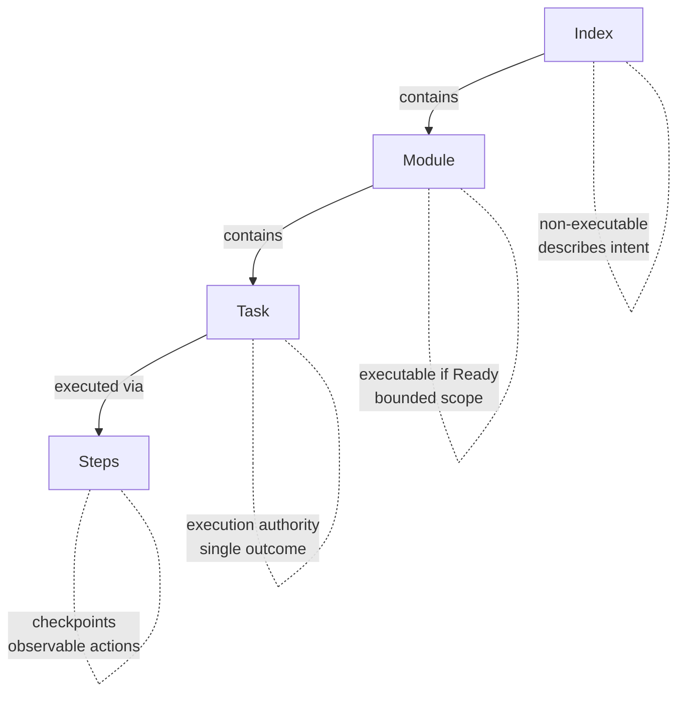

# Anvil Plan Spec (APS)

A lightweight specification format for planning and task authorisation in
AI-assisted development.

## What is APS?

APS provides a structured way to:

- **Plan work** before implementation begins
- **Authorise tasks** that AI agents can execute
- **Track execution** through observable checkpoints

It acts as a trust layer between humans and AI — humans remain accountable
for decisions while AI assists with planning and implementation.

## Why APS?

There's no shortage of AI coding tools — Cursor, Kiro, Claude Code, Copilot,
and countless agent frameworks. Each has its own way of handling context,
rules, and specifications. **The problem: your planning artifacts get locked
into whatever tool you're using today.**

APS is different:

- **Portable** — Plain markdown files. No vendor lock-in. Switch tools anytime.
- **Versioned** — Lives in git. Review plans in PRs. Track changes over time.
- **Tool-agnostic** — Works with any AI, any IDE, any workflow.
- **Human-readable** — Your PM, tech lead, and future self can all understand it.

APS isn't a replacement for your AI tools — it's the planning layer that works
*across* all of them. Write your spec once, use it everywhere.

> **Want to see APS in action?** Jump to [examples](examples/) or see the
> [Hello World](#hello-world-example) below.

## Hierarchy



| Layer | Purpose | Executable? |
|-------|---------|-------------|
| **Index** | High-level plan with modules and milestones | No |
| **Module** | Bounded scope with interfaces and tasks | If status is Ready |
| **Task** | Single coherent change with validation | Yes — execution authority |
| **Steps** | Ordered actions with checkpoints | Yes — granular execution |

**Key concepts:**

- **Index** — The root plan. Describes the whole initiative, lists modules.
- **Module** — A bounded area where work happens. The smallest unit you *plan*.
  You don't subdivide modules into sub-plans — they contain tasks directly.
- **Task** — A single authorised change. The unit of execution authority.
- **Steps** — How you *execute* a task. Optional, generated when needed. Breaks
  a task into checkpointed actions for granular progress tracking.

## Quick Start

### Option A: Scaffold (recommended)

```bash
# From the APS repo (after cloning)
./scaffold/init.sh /path/to/your-project

# Or via curl
curl -fsSL https://raw.githubusercontent.com/EddaCraft/anvil-plan-spec/main/scaffold/init.sh | bash

# Update existing project to latest templates (preserves your specs)
./scaffold/init.sh --update /path/to/your-project
```

This creates `plans/` with templates and `aps-rules.md` — a portable guide that
helps AI agents follow APS conventions.

### Option B: Manual Setup

1. Copy templates from `templates/` to your project
2. Create an Index to define your plan's scope and modules
3. Create Leaf modules for each bounded area of work
4. Add Tasks when a module is ready for implementation
5. Generate Steps (optional) for granular execution guidance

See [Getting Started](docs/getting-started.md) for a complete walkthrough.

## Works Everywhere

APS is just markdown. Use it however you work:

| Context | How to use APS |
|---------|----------------|
| **Claude / ChatGPT** | Paste the spec into your conversation |
| **Cursor / Copilot** | Keep specs in your repo, reference in prompts |
| **Claude Code / aider** | Point the agent at your spec files |
| **Jira / Linear / Notion** | Link to specs in git, or embed the markdown |
| **Code review** | Review spec changes in PRs before implementation |
| **Team planning** | Specs are human-readable — discuss them in meetings |

No plugins. No integrations. No configuration. It's just files.

## Templates

| Template | Use When |
|----------|----------|
| [quickstart.template.md](templates/quickstart.template.md) | **Try APS in 5 minutes** — minimal single-file format |
| [index.template.md](templates/index.template.md) | Starting a new plan or initiative |
| [index-expanded.template.md](templates/index-expanded.template.md) | Larger initiatives with 6+ modules or rich metadata |
| [module.template.md](templates/module.template.md) | Defining a bounded module with tasks |
| [simple.template.md](templates/simple.template.md) | Small, self-contained features |
| [steps.template.md](templates/steps.template.md) | Breaking tasks into executable steps |

### Hello World Example

```markdown
# Add Dark Mode

## Problem
Users want to reduce eye strain when working at night.

## Success
- [ ] Toggle persists across sessions
- [ ] All components respect theme

## Tasks

### 001: Add theme context
- **Outcome:** ThemeProvider wraps app, exposes toggle
- **Test:** `npm test -- theme.test.tsx`

### 002: Add toggle to settings
- **Outcome:** Settings page has working theme toggle
- **Test:** Manual verification
- **Depends on:** 001
```

## Examples

- [User Authentication](examples/user-auth/) — Adding auth to an existing app
- [OpenCode Companion App](examples/opencode-companion/) — Building a companion tool

## AI Guidance

When you scaffold APS into your project, it includes `aps-rules.md` — a portable
guide that travels with your specs. Point your AI agent at this file and it will
follow APS conventions (lean steps, outcome-focused tasks, etc.).

For deeper reference:

- [docs/ai/prompting/](docs/ai/prompting/) — Tool-agnostic prompts
- [docs/ai/prompting/opencode/](docs/ai/prompting/opencode/) — OpenCode/Claude variants

See [AGENTS.md](AGENTS.md) for collaboration rules when using AI in this repo.

## Principles

1. **Specs describe intent** — what and why, not how
2. **Tasks authorise execution** — no task, no implementation
3. **Humans remain accountable** — AI proposes, humans approve
4. **Checkpoints are observable** — every step has a verifiable state

## Project Structure

```text
your-project/
├── plans/
│   ├── aps-rules.md              # AI agent guidance (portable)
│   ├── index.aps.md              # Main plan
│   ├── modules/                  # Leaf modules
│   │   ├── auth.aps.md
│   │   └── payments.aps.md
│   ├── execution/                # Step files
│   │   └── AUTH-001.steps.md
│   └── decisions/                # ADRs (optional)
│       └── 001-use-jwt.md
```

## Versioning

This project does not currently publish versioned releases. The `main` branch
is considered stable. See [CHANGELOG.md](CHANGELOG.md) for recent changes.

## Roadmap

See [ROADMAP.md](ROADMAP.md) for planned features and direction.

## Contributing

See [CONTRIBUTING.md](CONTRIBUTING.md).

## License

Apache-2.0. See [LICENSE](LICENSE).
