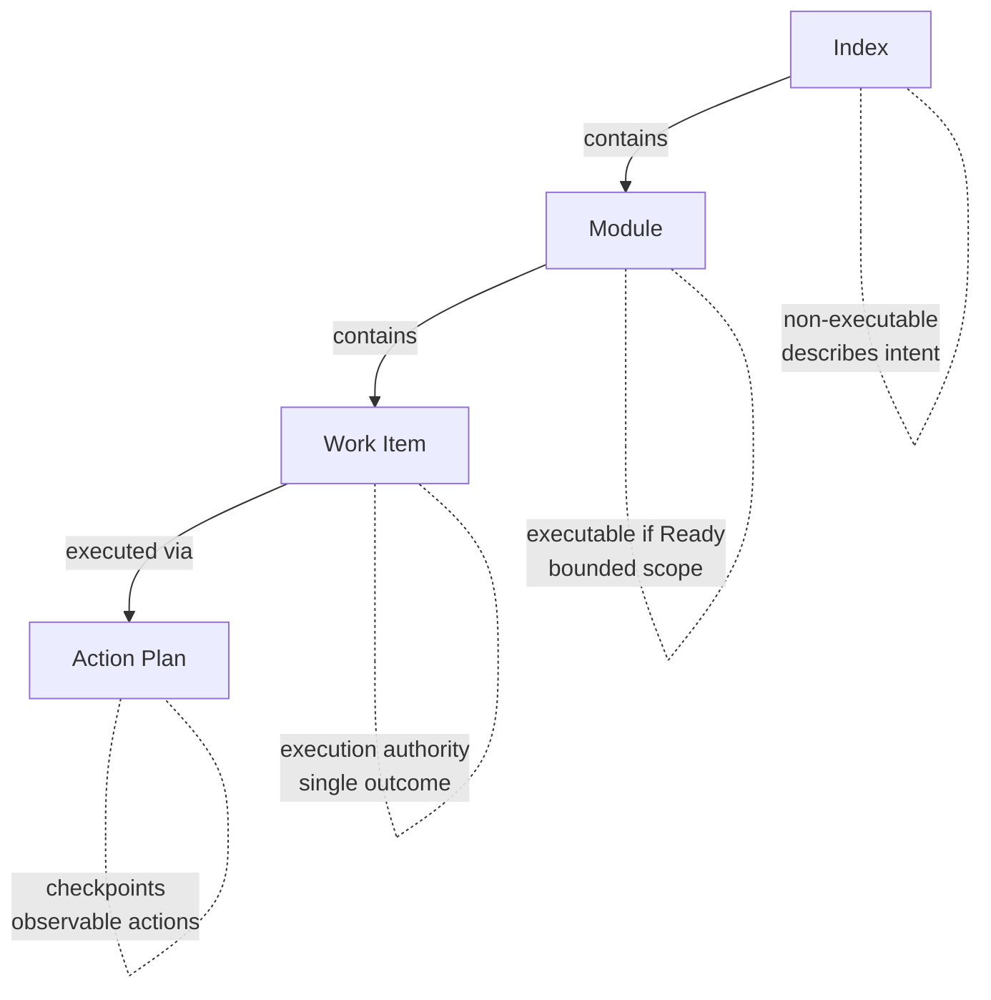

# Anvil Plan Spec (APS)

A lightweight specification format for planning and work item authorisation in
AI-assisted development.

## What is APS?

APS provides a structured way to:

- **Plan work** before implementation begins
- **Authorise work items** that AI agents can execute
- **Track execution** through observable checkpoints

It acts as a trust layer between humans and AI — humans remain accountable
for decisions while AI assists with planning and implementation.

## Why APS?

There's no shortage of AI coding tools — Cursor, Kiro, Claude Code, Copilot,
and countless agent frameworks. Each has its own way of handling context,
rules, and specifications. **The problem: your planning artefacts get locked
into whatever tool you're using today.**

APS is different:

- **Portable** — Plain markdown files. No vendor lock-in. Switch tools anytime.
- **Versioned** — Lives in git. Review plans in PRs. Track changes over time.
- **Tool-agnostic** — Works with any AI, any IDE, any workflow.
- **Human-readable** — Your PM, tech lead, and future self can all understand it.

APS isn't a replacement for your AI tools — it's the planning layer that works
*across* all of them. Write your spec once, use it everywhere.

> **Want to see APS in action?** Jump to [examples](examples/) or see the
> [Hello World](#hello-world-example) below.

## Philosophy: Compound Engineering

APS embraces the principle of **compound engineering**: each unit of engineering
work should make subsequent units easier—not harder.

Traditional development accumulates technical debt. Every feature adds complexity.
The codebase becomes harder to work with over time. Compound engineering inverts
this by investing heavily in planning and review upfront, so execution is fast
and clean.

**The 80/20 split:**

- **80% planning and review** — Thorough specs, clear work items, validated
  checkpoints
- **20% execution** — Fast implementation following well-defined plans

**The planning lifecycle:**

```
Plan → Execute → Validate → Learn → Plan again
  ↑                                      │
  └──────────────────────────────────────┘
```

| Phase | What Happens | How It Serves Planning |
|-------|--------------|------------------------|
| **Plan** | Define scope, success criteria, work items | Reference past patterns and solutions |
| **Execute** | Work against well-defined specs | Clean implementation, fewer blockers |
| **Validate** | Check outcomes against spec | Verify plan was correct, update if not |
| **Learn** | Document solutions and learnings | Future plans start with known answers |

Planning without validation is guesswork. Validation without learning repeats
mistakes. The cycle exists to make each plan better than the last.

See [docs/workflow.md](docs/workflow.md) for the full workflow guide.

## Hierarchy



| Layer | Purpose | Executable? |
|-------|---------|-------------|
| **Index** | High-level plan with modules and milestones | No |
| **Module** | Bounded scope with interfaces and work items | If status is Ready |
| **Work Item** | Single coherent change with validation | Yes — execution authority |
| **Action Plan** | Ordered actions with checkpoints | Yes — granular execution |

**Key concepts:**

- **Index** — The root plan. Describes the whole initiative, lists modules.
- **Module** — A bounded area where work happens. The smallest unit you *plan*.
  You don't subdivide modules into sub-plans — they contain work items directly.
- **Work Item** — A single authorised change. The unit of execution authority.
- **Action Plan** — How you *execute* a work item. Optional, generated when needed. Breaks
  a work item into checkpointed actions for granular progress tracking.

## Quick Start

### Option A: curl (recommended)

```bash
# Install in current directory
curl -fsSL https://raw.githubusercontent.com/EddaCraft/anvil-plan-spec/main/scaffold/install | bash

# Install in a specific directory
curl -fsSL https://raw.githubusercontent.com/EddaCraft/anvil-plan-spec/main/scaffold/install | bash -s -- /path/to/project

# Install a specific version (use a git tag or branch name, e.g., v0.2.0 or main)
curl -fsSL https://raw.githubusercontent.com/EddaCraft/anvil-plan-spec/main/scaffold/install | VERSION=v0.2.0 bash

# Update existing project (preserves your specs)
curl -fsSL https://raw.githubusercontent.com/EddaCraft/anvil-plan-spec/main/scaffold/update | bash
```

This creates `plans/` with templates and `aps-rules.md` — a portable guide that
helps AI agents follow APS conventions.

### Option B: Manual Setup

1. Copy templates from `templates/` to your project
2. Create an Index to define your plan's scope and modules
3. Create modules for each bounded area of work
4. Add Work Items when a module is ready for implementation
5. Generate Action Plans (optional) for granular execution guidance

See [Getting Started](docs/getting-started.md) for a complete walkthrough.

## Works Everywhere

APS is just markdown. Use it however you work:

| Context | How to use APS |
|---------|----------------|
| **Claude / ChatGPT** | Paste the spec into your conversation |
| **Cursor / Copilot** | Keep specs in your repo, reference in prompts |
| **Claude Code / aider** | Point the agent at your spec files |
| **Jira / Linear / Notion** | Link to specs in git, or embed the markdown |
| **Code review** | Review spec changes in PRs before implementation |
| **Team planning** | Specs are human-readable — discuss them in meetings |

No plugins. No integrations. No configuration. It's just files.

## Templates

| Template | Use When |
|----------|----------|
| [quickstart.template.md](templates/quickstart.template.md) | **Try APS in 5 minutes** — minimal single-file format |
| [index.template.md](templates/index.template.md) | Starting a new plan or initiative |
| [index-expanded.template.md](templates/index-expanded.template.md) | Larger initiatives with 6+ modules or rich metadata |
| [module.template.md](templates/module.template.md) | Defining a bounded module with work items |
| [simple.template.md](templates/simple.template.md) | Small, self-contained features |
| [actions.template.md](templates/actions.template.md) | Breaking work items into executable actions |
| [solution.template.md](templates/solution.template.md) | Documenting solved problems (compound phase) |

### Hello World Example

```markdown
# Add Dark Mode

## Problem
Users want to reduce eye strain when working at night.

## Success
- [ ] Toggle persists across sessions
- [ ] All components respect theme

## Work Items

### 001: Add theme context
- **Outcome:** ThemeProvider wraps app, exposes toggle
- **Test:** `npm test -- theme.test.tsx`

### 002: Add toggle to settings
- **Outcome:** Settings page has working theme toggle
- **Test:** Manual verification
- **Depends on:** 001
```

## Examples

- [User Authentication](examples/user-auth/) — Adding auth to an existing app
- [OpenCode Companion App](examples/opencode-companion/) — Building a companion tool

## AI Guidance

When you scaffold APS into your project, it includes `aps-rules.md` — a portable
guide that travels with your specs. Point your AI agent at this file and it will
follow APS conventions (lean steps, outcome-focused tasks, etc.).

For deeper reference:

- [docs/ai/prompting/](docs/ai/prompting/) — Tool-agnostic prompts
- [docs/ai/prompting/opencode/](docs/ai/prompting/opencode/) — OpenCode/Claude variants

See [AGENTS.md](AGENTS.md) for collaboration rules when using AI in this repo.

---

## 🤖 AI Agent Implementation Guide

> **This section is for LLMs and AI agents.** If you're an AI assistant being asked
> to work with APS, read this carefully. These instructions guide autonomous implementation
> without human intervention.

### Quick Decision Tree

```
Is there a plans/ directory?
├─ NO  → Initialize APS using scaffold (see Initialization below)
├─ YES → Does plans/index.aps.md exist?
   ├─ NO  → Create index using index.prompt.md
   ├─ YES → Read index, identify user's request type:
      ├─ Planning request → Generate/update specs (see Planning Workflow)
      ├─ Implementation request → Execute work items (see Execution Workflow)
      └─ Question → Read relevant specs, answer from context
```

### Core Principles for AI

1. **NEVER implement without a work item** — If no work item exists, create one first or ask
2. **ALWAYS read before you write** — Check existing specs and code patterns
3. **Work items are permission** — Status must be "Ready" before execution
4. **Checkpoints over instructions** — Write what should exist, not how to create it
5. **One work item at a time** — Complete and validate before moving to next

### Initialization Workflow

When user asks to "set up APS" or "initialize planning":

1. **Check for plans/ directory**
   - If missing: Create plans/ structure
   - Copy templates from templates/ (or use scaffold)

2. **Create plans/aps-rules.md**
   - Copy from [scaffold/plans/aps-rules.md](scaffold/plans/aps-rules.md)
   - This becomes the agent's reference guide

3. **Create plans/index.aps.md**
   - Use [docs/ai/prompting/index.prompt.md](docs/ai/prompting/index.prompt.md)
   - Fill with user's project context
   - List initial modules (no work items yet)

4. **Validate structure**
   - Checkpoint: `ls plans/` shows index.aps.md and aps-rules.md
   - Tell user: "APS initialized. Create modules when ready to plan."

### Planning Workflow

When user asks to plan a feature or break down work:

1. **Read context**

   ```bash
   # Must read before planning
   cat plans/index.aps.md              # Understand project scope
   cat plans/aps-rules.md              # Recall APS conventions
   ls plans/modules/                   # See existing modules
   ```

2. **Determine scope**
   - Small feature (1-3 work items)? → Use simple.template.md
   - Medium feature (4-8 work items)? → Use module.template.md
   - Large initiative (multiple modules)? → Update index, create leaf modules

3. **Create/update module spec**
   - Use [docs/ai/prompting/module.prompt.md](docs/ai/prompting/module.prompt.md)
   - Name: `plans/modules/[NN-name].aps.md` (numbered by dependency order)
   - Fill: Problem, Success Criteria, Interfaces, Boundaries
   - **Do NOT write work items yet** — leave empty unless scope is crystal clear

4. **Add work items only when module is Ready**
   - Use [docs/ai/prompting/work-item.prompt.md](docs/ai/prompting/work-item.prompt.md)
   - Each work item needs: Intent, Expected Outcome, Validation command
   - Work item IDs: `[MODULE-PREFIX]-NNN` (e.g., AUTH-001, CORE-001)

5. **Validate plan**
   - Checkpoint: Module file exists in plans/modules/
   - Checkpoint: Work items have validation commands
   - Tell user: "Plan ready. Mark work items as Ready when approved."

### Execution Workflow

When user asks to implement a feature or execute a work item:

1. **Find the work item**

   ```bash
   # Locate the spec
   grep -r "work item ID" plans/modules/
   cat plans/modules/[module-name].aps.md
   ```

2. **Verify execution authority**
   - Check work item status is "Ready"
   - Check dependencies are complete
   - If not Ready: Stop and ask user to approve

3. **Understand the outcome**
   - Read: Intent (what and why)
   - Read: Expected Outcome (observable result)
   - Read: Validation command (how to verify)
   - Explore codebase patterns (use existing conventions)

4. **Execute or create action plan**
   - **Simple work item (< 4 changes)?** → Implement directly
   - **Complex work item (≥ 4 changes)?** → Create action plan first

   If creating action plan:
   - Use [docs/ai/prompting/actions.prompt.md](docs/ai/prompting/actions.prompt.md)
   - Create: `plans/execution/[WORKITEM-ID].actions.md` using the full work item ID (e.g., `plans/execution/AUTH-001.actions.md`)
   - Write actions with observable checkpoints (max 12 words each)
   - **NO implementation detail** — just what should exist

5. **Implement step-by-step**
   - Execute one action at a time
   - Validate checkpoint after each action
   - If checkpoint fails: Debug, fix, validate again
   - If blocked: Document blocker, ask user

6. **Validate completion**

   ```bash
   # Run the validation command from work item
   [validation command from spec]
   ```

7. **Mark complete**
   - Update work item status to "Done"
   - Update action plan checkboxes (if used)
   - Report to user: "Work item [ID] complete. Validation passed."

### File Reading Priority

When starting work, read in this order:

1. **plans/aps-rules.md** — Your reference guide
2. **plans/index.aps.md** — Project overview
3. **plans/modules/[relevant].aps.md** — Specific module
4. **plans/execution/[WORKITEM-ID].actions.md** — Action plan (if exists)
5. **Codebase patterns** — Explore similar implementations

### Common Scenarios

| User Says | You Do |
|-----------|--------|
| "Set up planning for this project" | Initialization Workflow → Create index |
| "Plan the auth module" | Planning Workflow → Create module spec, NO work items yet |
| "Break down the auth work" | Planning Workflow → Add work items to existing module |
| "Implement AUTH-001" | Execution Workflow → Verify Ready, execute, validate |
| "What's the plan for payments?" | Read plans/modules/*payment*.aps.md, summarize |
| "Is this project using APS?" | Check for plans/ dir and aps-rules.md |

### Anti-Patterns to Avoid

| ❌ NEVER Do This | ✅ DO This Instead |
|------------------|-------------------|
| Implement without a work item | Create work item or ask for approval |
| Write implementation details in action plans | Write observable checkpoints only (≤12 words) |
| Execute work item with status "Proposed" | Ask user to approve (change status to Ready) |
| Create work items in every module at once | Create work items per module as it becomes Ready |
| Guess validation commands | Use language/framework conventions or ask |
| Skip reading aps-rules.md | Always read first — it contains your instructions |

### Prompt Entry Points

Use these prompts to generate APS documents:

| Document Type | Prompt File |
|---------------|-------------|
| Index (project root) | [docs/ai/prompting/index.prompt.md](docs/ai/prompting/index.prompt.md) |
| Module (bounded area) | [docs/ai/prompting/module.prompt.md](docs/ai/prompting/module.prompt.md) |
| Work Item (execution unit) | [docs/ai/prompting/work-item.prompt.md](docs/ai/prompting/work-item.prompt.md) |
| Action Plan (actions) | [docs/ai/prompting/actions.prompt.md](docs/ai/prompting/actions.prompt.md) |

**OpenCode/Claude variants:** [docs/ai/prompting/opencode/](docs/ai/prompting/opencode/)

### Self-Check Questions

Before implementing, ask yourself:

- [ ] Have I read plans/aps-rules.md this session?
- [ ] Does a work item exist for this change?
- [ ] Is the work item status "Ready"?
- [ ] Do I understand the Expected Outcome?
- [ ] Do I know the Validation command?
- [ ] Have I explored similar code patterns?
- [ ] Am I writing checkpoints (not implementation steps)?

### When Uncertain

1. **Read more context** — Check aps-rules.md, explore modules/
2. **Ask the user** — "Should I create a work item for this?"
3. **Propose a plan** — "I'll create AUTH-001 with outcome X. Proceed?"

**Remember:** Humans approve, AI executes. When in doubt, ask.

---

## Principles

1. **Specs describe intent** — what and why, not how
2. **Work items authorise execution** — no work item, no implementation
3. **Humans remain accountable** — AI proposes, humans approve
4. **Checkpoints are observable** — every action has a verifiable state

## Project Structure

```text
your-project/
├── plans/
│   ├── aps-rules.md              # AI agent guidance (portable)
│   ├── index.aps.md              # Main plan
│   ├── modules/                  # Leaf modules
│   │   ├── auth.aps.md
│   │   └── payments.aps.md
│   ├── execution/                # Action plan files
│   │   └── AUTH-001.actions.md
│   └── decisions/                # ADRs (optional)
│       └── 001-use-jwt.md
```

## Versioning

This project does not currently publish versioned releases. The `main` branch
is considered stable. See [CHANGELOG.md](CHANGELOG.md) for recent changes.

## Roadmap

See [ROADMAP.md](ROADMAP.md) for planned features and direction.

## Contributing

See [CONTRIBUTING.md](CONTRIBUTING.md).

## License

Apache-2.0. See [LICENSE](LICENSE).
