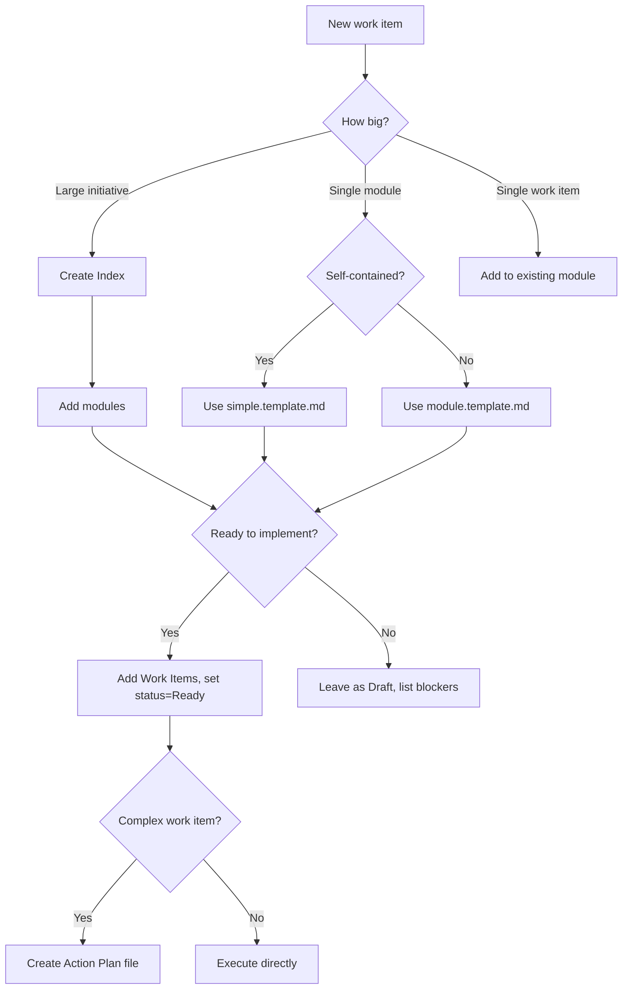

# Getting Started with APS

This guide walks you through adopting Anvil Plan Spec (APS) in your project.

## Which Template Should I Use?

Start here. Pick based on what you're trying to do:

| Situation | Template | Time to Value |
|-----------|----------|---------------|
| **Just trying APS** | [quickstart](../templates/quickstart.template.md) | 5 minutes |
| **Small feature (1-3 work items, self-contained) | [simple](../templates/simple.template.md) | 15 minutes |
| **Module with boundaries** (interfaces, deps) | [module](../templates/module.template.md) | 30 minutes |
| **Multi-module initiative** | [index](../templates/index.template.md) | 1 hour |
| **Large initiative** (6+ modules) | [index-expanded](../templates/index-expanded.template.md) | 1-2 hours |
| **Monorepo** (multiple packages/apps) | [index-monorepo](../templates/index-monorepo.template.md) | 1-2 hours |
| **Breaking a work item into actions** | [actions](../templates/actions.template.md) | 15 minutes |
| **Tracking dev-time discoveries** | [issues](../templates/issues.template.md) | 10 minutes |

### Decision Tree



## Quick Start

**Want to see APS in action first?** Check the [examples](../examples/):

- [User Authentication](../examples/user-auth/) — Adding auth to an existing app
- [OpenCode Companion](../examples/opencode-companion/) — Building a new tool

**Solo developer?** You don't need the full ceremony:

- Use `simple.template.md` for most features
- Skip formal modules — go straight to work items
- Only create an Index if you're planning weeks of work
- Steps files are optional — use when a work item feels complex

**Ready to scaffold?** Run this in your project:

```bash
# From a cloned APS repo
./scaffold/init.sh /path/to/your-project

# Or via curl (once repo is public)
curl -fsSL https://raw.githubusercontent.com/EddaCraft/anvil-plan-spec/main/scaffold/init.sh | bash
```

This creates `plans/` with templates and `aps-rules.md` for AI guidance.

## Prerequisites

- A project repository (any language/framework)
- Familiarity with markdown

## Setting Up Manually

If you prefer manual setup over the scaffold script:

### 1. Create folder structure

```text
your-project/
├── plans/
│   ├── index.aps.md           # Your main plan
│   ├── issues.md              # Development-time discoveries
│   ├── modules/               # Module specs
│   │   └── feature.aps.md
│   ├── execution/             # Action plan files
│   │   └── FEAT-001.actions.md
│   └── decisions/             # ADRs (optional)
│       └── 001-use-jwt.md
```

### 2. Create your Index

Copy `index.template.md` to `plans/index.aps.md`. Fill in:

1. **Problem** — What are you solving?
2. **Success Criteria** — How do you know you're done?
3. **Modules** — List each bounded area of work

> **Tip:** The Index is non-executable. Focus on intent, not implementation.

### 3. Create Modules

For each module, create a file in `plans/modules/`:

- `module.template.md` — For modules with interfaces and dependencies
- `simple.template.md` — For small, self-contained features

Fill in Purpose, Scope, and leave Tasks empty until Ready.

### 4. Add Tasks When Ready

Tasks are **execution authority**. Only add them when:

- The module scope is clear
- Dependencies are resolved
- You're ready to implement

Each task needs:

- **Intent** — One sentence on what it achieves
- **Expected Outcome** — Testable result
- **Validation** — How to verify completion

### 5. Generate Steps (Optional)

For complex tasks, create a steps file in `plans/execution/`.

Steps translate "what to achieve" into "what actions to take":

- Each step has a **checkpoint** (observable state)
- Steps describe **what**, not **how**

### 6. Track Issues & Questions

As you develop, you'll discover issues and questions that emerge during implementation — things that weren't apparent during planning. Log these in `plans/issues.md`:

- **Issues (ISS-NNN)** — Bugs, limitations, tech debt, edge cases
- **Questions (Q-NNN)** — Unknowns that need answers, deferred decisions

This keeps planning-level concerns visible without cluttering work items or your bug tracker.

## Monorepo Setup

Working in a monorepo with multiple packages/apps? See [monorepo.md](./monorepo.md) for full guidance. Key differences:

1. **Use the monorepo index template** — [index-monorepo.template.md](../templates/index-monorepo.template.md)
2. **Add Packages to modules** — Each module declares which packages it affects
3. **"What's Next" view** — Prioritized queue across all packages
4. **"By Package" view** — Navigation grouped by package
5. **Session rituals** — Start/end rituals keep docs in sync

```text
monorepo/
├── plans/
│   ├── index.aps.md              # Uses index-monorepo format
│   └── modules/
│       ├── 01-auth.aps.md        # Packages: core, api
│       └── 02-cli.aps.md         # Packages: cli, shared
├── apps/
│   └── api/
└── packages/
    └── core/
```

## Index Template Formats

APS provides three index formats:

**Table format** (`index.template.md`) — compact, scannable, best for 2-6 modules:

```markdown
| Module | Purpose | Status | Dependencies |
|--------|---------|--------|--------------|
| [auth](./modules/auth.aps.md) | User authentication | Ready | — |
```

**List format** (`index-expanded.template.md`) — more readable with many modules:

```markdown
### auth

- **Path:** ./modules/auth.aps.md
- **Status:** Ready
- **Priority:** high
- **Dependencies:** database, session
```

## Working with AI Assistants

APS includes prompts for AI tools:

| Task | Prompt |
|------|--------|
| Planning | `docs/ai/prompting/index.prompt.md` |
| Module design | `docs/ai/prompting/module.prompt.md` |
| Task creation | `docs/ai/prompting/task.prompt.md` |
| Execution | `docs/ai/prompting/steps.prompt.md` |

OpenCode/Claude users: see `docs/ai/prompting/opencode/` for optimized variants.

When you scaffold APS, it includes `aps-rules.md` — point your AI agent at this
file and it will follow APS conventions automatically.

## Next Steps

- Review [workflow.md](./workflow.md) for day-to-day usage patterns
- Read [monorepo.md](./monorepo.md) if working in a multi-package repository
- Read [AGENTS.md](../AGENTS.md) for AI collaboration rules in this repo
