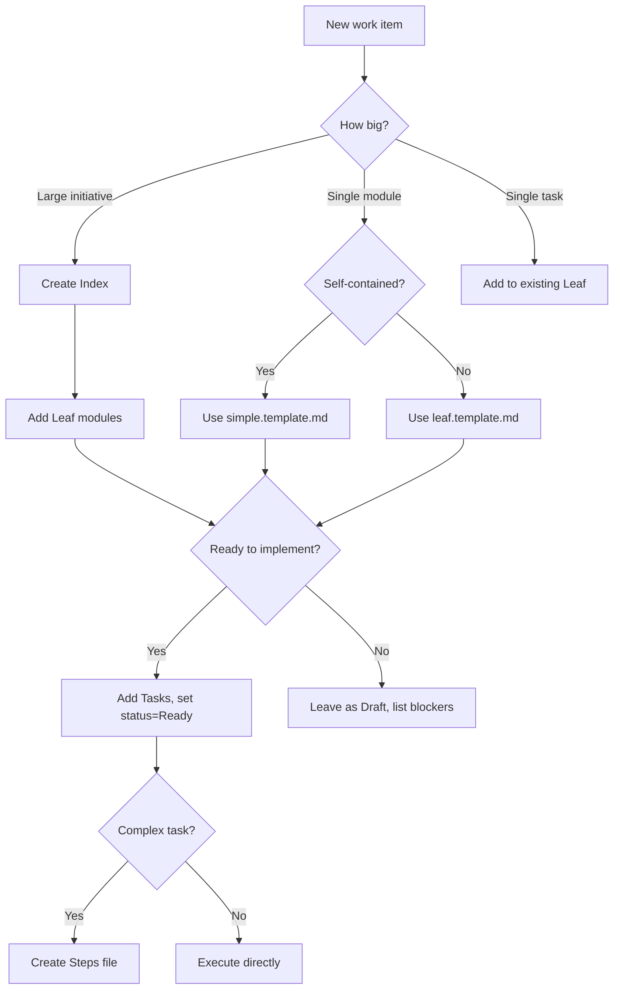

# Getting Started with APS

This guide walks you through adopting Anvil Plan Spec (APS) in your project.

## Prerequisites

- A project repository (any language/framework)
- Familiarity with markdown

## Step 1: Set Up Your Folder Structure

Create the following structure in your project:

```text
your-project/
├── plans/
│   ├── index.aps.md           # Your main plan
│   ├── modules/               # Leaf modules
│   │   ├── auth.aps.md
│   │   └── payments.aps.md
│   ├── execution/             # Step files
│   │   └── AUTH-001.steps.md
│   └── decisions/             # ADRs (optional)
│       └── 001-use-jwt.md
```

## Step 2: Create Your Index

Copy `templates/index.template.md` to `plans/index.aps.md`.

Fill in:

1. **Problem** — What are you solving?
2. **Success Criteria** — How do you know you're done?
3. **System Map** — How do modules relate?
4. **Modules** — List each bounded area of work

> **Tip:** The Index is non-executable. Focus on intent, not implementation.

## Step 3: Create Leaf Modules

For each module in your Index, create a file in `plans/modules/`.

**Choose your template:**

- Use `templates/leaf.template.md` for modules with interfaces and boundaries
- Use `templates/simple.template.md` for small, self-contained features

### Leaf Template (full)

Copy `templates/leaf.template.md` and fill in:

1. **Purpose** — Why does this module exist?
2. **In Scope / Out of Scope** — Clear boundaries
3. **Interfaces** — What it depends on and exposes
4. **Boundary Rules** — Architectural constraints
5. **Tasks** — Only when status is Ready

### Simple Template (lightweight)

Copy `templates/simple.template.md` for features that:

- Don't have complex interfaces
- Don't need boundary rules
- Are self-contained (1-3 tasks)

Fill in:

1. **Purpose** — What problem it solves
2. **Success Criteria** — How you know it's done
3. **Tasks** — The work to do

> **Tip:** Keep modules small. If you have >8 tasks, consider splitting.

## Step 4: Add Tasks When Ready

Tasks are **execution authority**. Only add them when:

- The module scope is clear
- Dependencies are resolved
- You're ready to implement

Each task needs:

- **Intent** — One sentence on what it achieves
- **Expected Outcome** — Testable result
- **Validation** — How to verify completion

## Step 5: Generate Steps (Optional)

For complex tasks, create a steps file in `plans/execution/`.

Steps translate "what to achieve" into "what actions to take":

- Each step has a **checkpoint** (observable state)
- Steps describe **what**, not **how**
- "How" only appears when referencing existing patterns

## Workflow Decision Tree



## When to Use Each Template

| Situation | Template |
|-----------|----------|
| Planning a multi-module initiative | `index.template.md` |
| Defining a bounded area with multiple tasks | `leaf.template.md` |
| Small feature that fits in one file | `simple.template.md` |
| Breaking a task into granular actions | `steps.template.md` |

## Working with AI Assistants

APS includes prompts for AI tools. To use them:

1. **For planning:** Reference `docs/ai/prompting/index.prompt.md`
2. **For module design:** Reference `docs/ai/prompting/leaf.prompt.md`
3. **For task creation:** Reference `docs/ai/prompting/task.prompt.md`
4. **For execution:** Reference `docs/ai/prompting/steps.prompt.md`

OpenCode/Claude users can use the variants in `docs/ai/prompting/opencode/`.

## Next Steps

- Review the [examples](../examples/) for complete worked examples
- Read [AGENTS.md](../AGENTS.md) for AI collaboration rules
