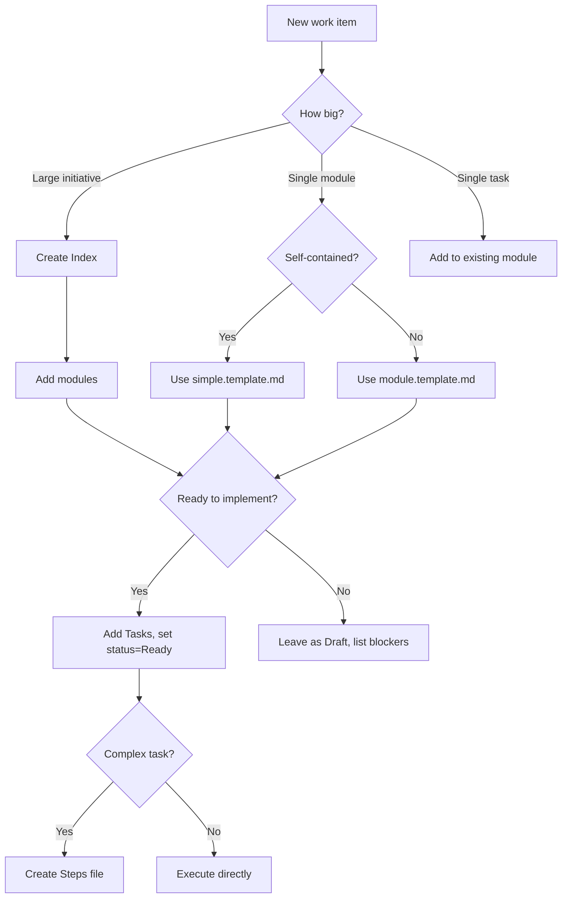

# Getting Started with APS

This guide walks you through adopting Anvil Plan Spec (APS) in your project.

## Which Template Should I Use?

Start here. Pick based on what you're trying to do:

| Situation | Template | Time to Value |
|-----------|----------|---------------|
| **Just trying APS** | [quickstart](../templates/quickstart.template.md) | 5 minutes |
| **Small feature** (1-3 tasks, self-contained) | [simple](../templates/simple.template.md) | 15 minutes |
| **Module with boundaries** (interfaces, deps) | [module](../templates/module.template.md) | 30 minutes |
| **Multi-module initiative** | [index](../templates/index.template.md) | 1 hour |
| **Large initiative** (6+ modules) | [index-expanded](../templates/index-expanded.template.md) | 1-2 hours |
| **Breaking a task into actions** | [steps](../templates/steps.template.md) | 15 minutes |

### Decision Tree



## Quick Start

**Want to see APS in action first?** Check the [examples](../examples/):

- [User Authentication](../examples/user-auth/) — Adding auth to an existing app
- [OpenCode Companion](../examples/opencode-companion/) — Building a new tool

**Solo developer?** You don't need the full ceremony:

- Use `simple.template.md` for most features
- Skip formal modules — go straight to tasks
- Only create an Index if you're planning weeks of work
- Steps files are optional — use when a task feels complex

**Ready to scaffold?** Run this in your project:

```bash
# From a cloned APS repo
./scaffold/init.sh /path/to/your-project

# Or via curl (once repo is public)
curl -fsSL https://raw.githubusercontent.com/EddaCraft/anvil-plan-spec/main/scaffold/init.sh | bash
```

This creates `plans/` with templates and `aps-rules.md` for AI guidance.

## Prerequisites

- A project repository (any language/framework)
- Familiarity with markdown

## Setting Up Manually

If you prefer manual setup over the scaffold script:

### 1. Create folder structure

```text
your-project/
├── plans/
│   ├── index.aps.md           # Your main plan
│   ├── modules/               # Module specs
│   │   └── feature.aps.md
│   ├── execution/             # Step files
│   │   └── FEAT-001.steps.md
│   └── decisions/             # ADRs (optional)
│       └── 001-use-jwt.md
```

### 2. Create your Index

Copy `index.template.md` to `plans/index.aps.md`. Fill in:

1. **Problem** — What are you solving?
2. **Success Criteria** — How do you know you're done?
3. **Modules** — List each bounded area of work

> **Tip:** The Index is non-executable. Focus on intent, not implementation.

### 3. Create Modules

For each module, create a file in `plans/modules/`:

- `module.template.md` — For modules with interfaces and dependencies
- `simple.template.md` — For small, self-contained features

Fill in Purpose, Scope, and leave Tasks empty until Ready.

### 4. Add Tasks When Ready

Tasks are **execution authority**. Only add them when:

- The module scope is clear
- Dependencies are resolved
- You're ready to implement

Each task needs:

- **Intent** — One sentence on what it achieves
- **Expected Outcome** — Testable result
- **Validation** — How to verify completion

### 5. Generate Steps (Optional)

For complex tasks, create a steps file in `plans/execution/`.

Steps translate "what to achieve" into "what actions to take":

- Each step has a **checkpoint** (observable state)
- Steps describe **what**, not **how**

## Index Template Formats

APS provides two index formats:

**Table format** (`index.template.md`) — compact, scannable, best for 2-6 modules:

```markdown
| Module | Purpose | Status | Dependencies |
|--------|---------|--------|--------------|
| [auth](./modules/auth.aps.md) | User authentication | Ready | — |
```

**List format** (`index-expanded.template.md`) — more readable with many modules:

```markdown
### auth

- **Path:** ./modules/auth.aps.md
- **Status:** Ready
- **Priority:** high
- **Dependencies:** database, session
```

## Working with AI Assistants

APS includes prompts for AI tools:

| Task | Prompt |
|------|--------|
| Planning | `docs/ai/prompting/index.prompt.md` |
| Module design | `docs/ai/prompting/module.prompt.md` |
| Task creation | `docs/ai/prompting/task.prompt.md` |
| Execution | `docs/ai/prompting/steps.prompt.md` |

OpenCode/Claude users: see `docs/ai/prompting/opencode/` for optimized variants.

When you scaffold APS, it includes `aps-rules.md` — point your AI agent at this
file and it will follow APS conventions automatically.

## Next Steps

- Review [workflow.md](./workflow.md) for day-to-day usage patterns
- Read [AGENTS.md](../AGENTS.md) for AI collaboration rules in this repo
