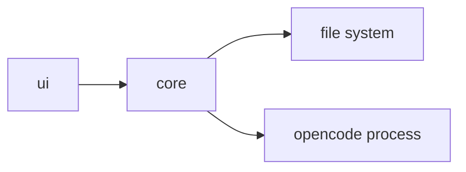

<!-- APS: See docs/ai/prompting/ for AI guidance -->
<!-- This document is non-executable. -->

# OpenCode Companion App

## Overview

Build a companion application for OpenCode that provides a visual interface for managing coding sessions, viewing history, and configuring settings.

## Problem & Success Criteria

**Problem:** OpenCode is CLI-only. Users want a visual way to browse session history, manage configurations, and see real-time progress without switching to terminal.

**Success Criteria:**

- [ ] Users can view past coding sessions with full context
- [ ] Users can edit OpenCode configuration through UI
- [ ] Real-time updates show current session progress
- [ ] Works alongside OpenCode without interference

## Constraints

- Must run locally (no cloud dependency)
- Must not modify OpenCode core — companion only
- Must support macOS and Linux (Windows stretch goal)

## System Map

## Milestones

### M1: Read-Only Viewer

- **Target:** Sprint 1
- **Includes:** core module, basic UI

### M2: Configuration Editor

- **Target:** Sprint 2
- **Includes:** settings UI, config persistence

### M3: Real-Time Updates

- **Target:** Sprint 3
- **Includes:** process monitoring, live updates

## Modules

| Module | Scope | Owner | Status | Priority | Dependencies |
|--------|-------|-------|--------|----------|--------------|
| [core](./modules/core.aps.md) | CORE | @josh | Ready | high | — |
| [ui](./modules/ui.aps.md) | UI | @josh | Draft | high | core |

## Risks & Mitigations

| Risk | Impact | Likelihood | Mitigation |
|------|--------|------------|------------|
| OpenCode config format changes | medium | medium | Version detection, graceful degradation |
| File watching performance | low | low | Use native fs.watch, debounce |

## Decisions

- **D-001:** Use Tauri for desktop app — lightweight, Rust backend, web frontend
- **D-002:** Read OpenCode config directly from disk — no IPC needed for v1

## Open Questions

- [ ] Should we support multiple OpenCode installations?
- [ ] How do we detect the active OpenCode session?
