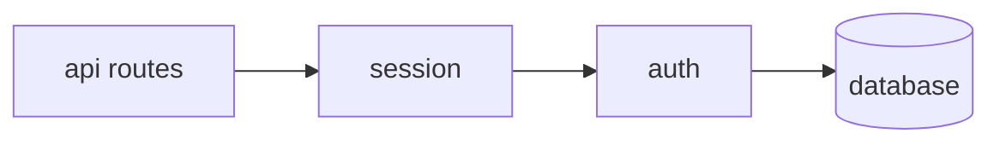

<!-- APS: See docs/ai/prompting/ for AI guidance. Anti-patterns: docs/ai/policies/ai-anti-patterns.md -->
<!-- This document is non-executable. -->

# User Authentication

## Overview

Add user authentication to an existing web application. Users should be able to register, log in, and maintain sessions across requests.

## Problem & Success Criteria

**Problem:** The application currently has no user authentication. All users see the same content and cannot save personal data.

**Success Criteria:**

- [ ] Users can register with email and password
- [ ] Users can log in and receive a session token
- [ ] Protected routes reject unauthenticated requests
- [ ] Sessions persist across browser refreshes

## Constraints

- Must use existing PostgreSQL database
- Must not require additional infrastructure (no Redis for sessions in v1)
- Password storage must use bcrypt with cost factor ≥12

## System Map

## Milestones

### M1: Core Authentication

- **Target:** Week 1
- **Includes:** auth module, session module

### M2: Protected Routes

- **Target:** Week 2
- **Includes:** API integration, middleware

## Modules

| Module | Scope | Owner | Status | Priority | Dependencies |
|--------|-------|-------|--------|----------|--------------|
| [auth](./modules/auth.aps.md) | AUTH | @josh | Ready | high | — |
| [session](./modules/session.aps.md) | SESSION | @josh | Draft | high | auth |

## Risks & Mitigations

| Risk | Impact | Likelihood | Mitigation |
|------|--------|------------|------------|
| Password breach | high | low | Use bcrypt, enforce strong passwords |
| Session hijacking | high | medium | Use httpOnly cookies, short expiry |

## Decisions

- **D-001:** Use JWT for session tokens — stateless, no Redis needed
- **D-002:** Store refresh tokens in DB — allows revocation

## Open Questions

- [ ] Should we support OAuth providers in v1?
- [ ] What's the session expiry time? (proposed: 1 hour access, 7 day refresh)
