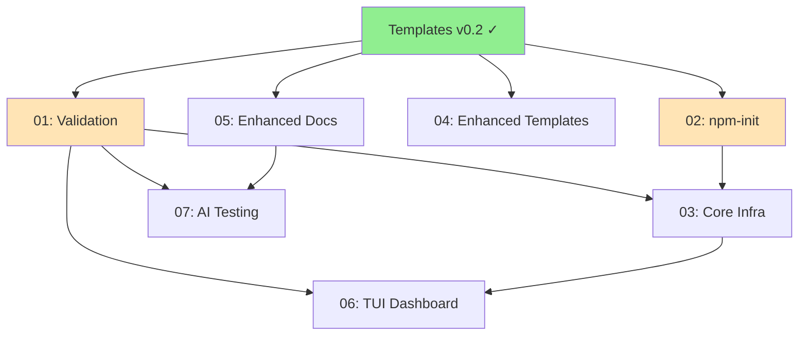

# APS v0.3 — Production Ready

| Field | Value |
|-------|-------|
| Status | Draft |
| Owner | @aneki |
| Created | 2026-01-15 |
| Previous | v0.2 (Usability & Adoption) |

## Problem

APS v0.2 addressed basic usability but to be production-ready we need:

1. **Machine discoverability** — AI agents need programmatic config discovery
2. **Validation tooling** — Users need feedback on APS document quality
3. **Zero-friction onboarding** — `npm init aps` should be the primary path
4. **Visual progress tracking** — TUI dashboard for status visibility
5. **AI agent reliability** — Test harness to verify agent compliance
6. **Enhanced templates** — Inline examples and visual differentiation

This builds on v0.2 (scaffold, templates, docs) to create a complete, production-ready system.

## Success Criteria

- [ ] `npm init aps` is the hero of README.md
- [ ] `.aps/config.json` enables programmatic discovery
- [ ] `aps lint` validates all aspects of APS documents
- [ ] `aps status` shows TUI dashboard with progress visualization
- [ ] AI agent test suite passes for Claude, GPT-4, and Cursor
- [ ] Templates have inline examples users can follow
- [ ] All terminology migration complete (no "Task" or "Step" references)

## Constraints

- No runtime dependencies for APS documents (stay pure markdown)
- No breaking changes to existing v0.2 template structure
- TUI before web (keep web dashboard on long-term roadmap)
- Skip IDE integration for now
- All changes must pass markdownlint

## Modules

| # | Module | Purpose | Status | Dependencies |
|---|--------|---------|--------|--------------|
| 01 | [validation](./modules/validation.aps.md) | CLI validator for APS documents | Ready | TPL ✓ |
| 02 | [npm-init](./modules/npm-init.aps.md) | `npm init aps` interactive setup | Ready | TPL ✓ |
| 03 | [core-infra](./modules/v0.3/core-infra.aps.md) | Config discovery, frontmatter, schemas | Draft | VAL, INIT |
| 04 | [enhanced-templates](./modules/v0.3/enhanced-templates.aps.md) | Inline examples, visual markers | Draft | TPL ✓ |
| 05 | [enhanced-docs](./modules/v0.3/enhanced-docs.aps.md) | AI decision trees, term completion | Draft | TPL ✓ |
| 06 | [tui](./modules/v0.3/tui.aps.md) | Terminal dashboard for status | Draft | VAL, CORE |
| 07 | [ai-testing](./modules/v0.3/ai-testing.aps.md) | Agent test scenarios and evaluation | Draft | VAL, DOCS |

## System Map

## Execution Strategy

### Phase 1: Foundation (P0 - Week 1)
Complete validation and npm-init to unblock everything else:
1. Execute VAL-001 through VAL-006 (validation CLI)
2. Execute INIT-001 through INIT-010 (npm package)
3. Publish `create-aps` to npm

### Phase 2: Core Infrastructure (P0 - Week 1-2)
Enable machine discoverability:
1. Create `.aps/config.json` spec
2. Add frontmatter support to templates
3. Create JSON schema for validation

### Phase 3: Enhanced Content (P1 - Week 2)
Improve template and documentation usability:
1. Add inline examples to all templates
2. Add visual markers (emoji/tags) for required/optional
3. Complete terminology migration (grep audit)
4. Add AI decision tree to aps-rules.md
5. Enhance prompting docs with before/after examples

### Phase 4: Tooling (P1 - Week 3)
Build TUI and testing infrastructure:
1. Create `aps status` TUI dashboard
2. Build AI agent test framework
3. Create test scenarios for major agents

### Phase 5: Polish (P2 - Week 4)
Integration and documentation:
1. Update README.md (npm init as hero)
2. Create video walkthrough or GIF demos
3. Add troubleshooting guide
4. Publish comprehensive blog post

## Risks

| Risk | Impact | Mitigation |
|------|--------|------------|
| npm package name collision | High | Check availability early, have fallback names |
| Frontmatter breaks existing parsers | Medium | Make frontmatter optional, test with common tools |
| TUI complexity delays release | Medium | Start with simple status list, enhance iteratively |
| AI test scenarios don't generalize | Medium | Test across multiple agents early, adjust scenarios |
| Scope creep into web dashboard | Low | Firm commitment to TUI first, web on long-term roadmap |

## Open Questions

- [ ] npm package name: `create-aps` vs `@anvil/create-aps`?
- [ ] Should `.aps/config.json` be required or optional?
- [ ] TUI library: blessed, ink (React), or raw terminal codes?
- [ ] Should frontmatter be in all templates or just for tooling?
- [ ] GitHub Action for validation included in Phase 1 or deferred?

## Decisions

- **D-001:** Frontmatter format — *decided: YAML frontmatter (compatible with most parsers)*
- **D-002:** Config location — *decided: `.aps/config.json` (hidden directory, not in plans/)*
- **D-003:** TUI before web — *decided: yes, web on long-term roadmap*
- **D-004:** Skip IDE integration — *decided: yes, defer to future release*
- **D-005:** Validation CLI language — *decided: Node.js (enables npm package reuse, JSON parsing)*

## Out of Scope for v0.3

- IDE extensions (VS Code, JetBrains)
- Web-based dashboard
- Hosted template registry
- Template marketplace
- Real-time collaboration features
- Integration with project management tools (Jira, Linear)
- Automated spec generation from code
- AI-powered spec suggestions

## Success Metrics

We'll know v0.3 succeeded when:
- npm weekly downloads > 100 within first month
- Validation catches >80% of common errors (test against known-bad fixtures)
- AI agent test pass rate > 90% (Claude, GPT-4, Cursor)
- User feedback: "Setup took < 5 minutes" in >75% of cases
- GitHub stars increase by 50% (demonstrates improved discoverability)

## Notes

- v0.2 modules (scaffold, templates, docs) are prerequisites
- This plan assumes v0.2 is complete or near-complete
- Can run Phase 1 and Phase 2 in parallel (different file areas)
- Phase 4 (tooling) can be parallelized (TUI and AI testing independent)
