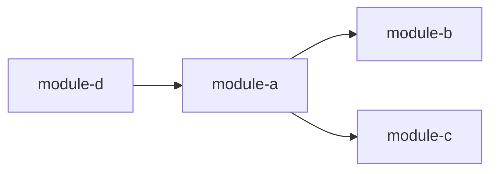

<!-- APS: See docs/ai/prompting/ for AI guidance -->
<!-- This document is non-executable. -->
<!-- For simpler projects, see index.template.md -->

# [Plan Title]

## Overview

[One paragraph describing what this plan covers and why it matters]

## Problem & Success Criteria

**Problem:** [What problem are we solving? Why does this work matter?]

**Why this work matters:** [Deeper context on motivation and impact]

**Non-goals (explicit):**

- [What this plan explicitly does NOT cover]
- [Scope boundaries to prevent creep]

**Success Criteria:**

- [ ] [Measurable outcome 1]
- [ ] [Measurable outcome 2]
- [ ] [How we know we're done]

## Constraints

- [Technical constraint, e.g., "Must run on Node 18+"]
- [Product constraint, e.g., "Must not break existing API"]

## System Map

- `module-a` depends on `module-b`, `module-c`
- `module-d` depends on `module-a`

## Milestones

### M1: [Milestone Name]

- [Deliverable 1]
- [Deliverable 2]

**Target:** [Date, sprint, or scope description]

### M2: [Milestone Name]

- [Deliverable 1]
- [Deliverable 2]

**Target:** [Date, sprint, or scope description]

## Modules

### module-name

- **Path:** ./modules/module-name.aps.md
- **Scope:** SCOPE
- **Owner:** @username
- **Status:** Draft
- **Priority:** high
- **Tags:** core, domain
- **Dependencies:** —

### another-module

- **Path:** ./modules/another-module.aps.md
- **Scope:** SCOPE2
- **Owner:** @username
- **Status:** Draft
- **Priority:** medium
- **Tags:** api, integration
- **Dependencies:** module-name

### third-module

- **Path:** ./modules/third-module.aps.md
- **Scope:** SCOPE3
- **Owner:** @username
- **Status:** Draft
- **Priority:** low
- **Tags:** tooling, cli
- **Dependencies:** module-name, another-module

## Risks & Mitigations

| Risk | Impact | Likelihood | Mitigation |
|------|--------|------------|------------|
| [Risk description] | high | medium | [How we address it] |

## Decisions

- **D-001:** [Short decision] — [rationale]
- **D-002:** [Another decision] — [rationale]

## Open Questions

- [ ] [Unresolved question 1]
- [ ] [Unresolved question 2]
