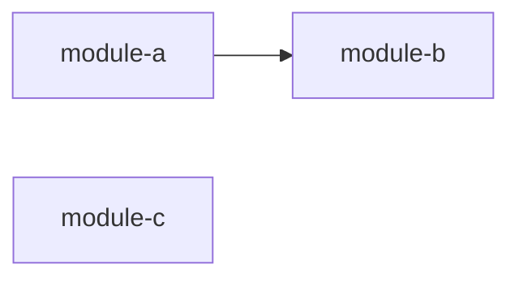

<!-- APS: See docs/ai/prompting/ for AI guidance. Anti-patterns: docs/ai/policies/ai-anti-patterns.md -->
<!-- This document is non-executable. -->

# [Plan Title]

## Overview

[One paragraph describing what this plan covers and why it matters]

## Problem & Success Criteria

**Problem:** [What problem are we solving? Why does this work matter?]

**Success Criteria:**

- [ ] [Measurable outcome 1]
- [ ] [Measurable outcome 2]
- [ ] [How we know we're done]

## Constraints

- [Technical constraint, e.g., "Must run on Node 18+"]
- [Product constraint, e.g., "Must not break existing API"]

## System Map

## Milestones

### M1: [Milestone Name]

- **Target:** [date or scope]
- **Includes:** [modules/features]

### M2: [Milestone Name]

- **Target:** [date or scope]
- **Includes:** [modules/features]

## Modules

| Module | Scope | Owner | Status | Priority | Dependencies |
|--------|-------|-------|--------|----------|--------------|
| [module-id](./modules/module-name.aps.md) | SCOPE | @username | Draft | medium | — |
| [another-id](./modules/another.aps.md) | SCOPE2 | @username | Draft | high | module-id |

## Risks & Mitigations

| Risk | Impact | Likelihood | Mitigation |
|------|--------|------------|------------|
| [Risk description] | high | medium | [How we address it] |

## Decisions

- **D-001:** [Short decision] — [rationale] ([ADR-001](./decisions/001-decision.md))

## Open Questions

- [ ] [Unresolved question 1]
- [ ] [Unresolved question 2]
